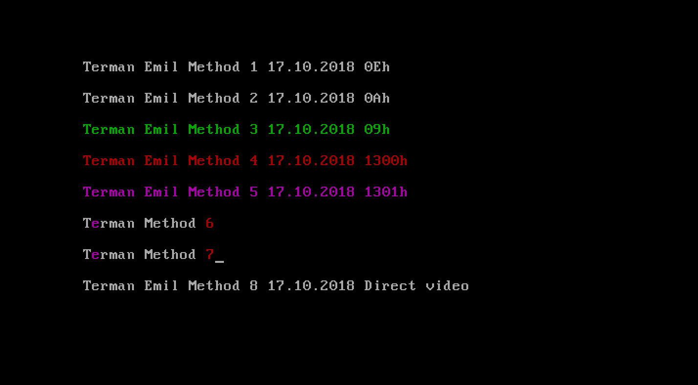
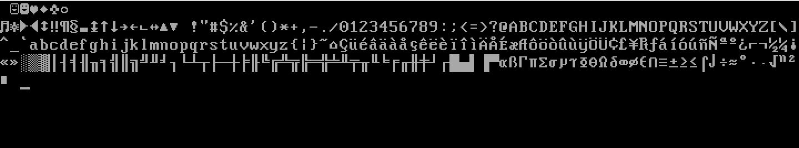
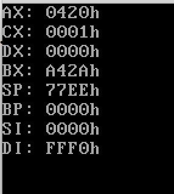

# Lab 1

To run each task, the **.bin** file had to be converted in the standard floppy format. To do that, I simply add extra Bytes to the .bin file to get a total of 1474560 B.

## Task 1
Print some text with 8 different methods.

**Method:**
  1. **INT** 10h **AH** = 0Eh. Loop through every char of a string and print it;
  2. **INT** 10h **AH** = 0Ah. Loop through every char of a string, set the corresponding position and print it;
  3. **INT** 10h **AH** = 09h. The same as **2**, but specify an attribute for printing. I used green text color.
  4. **INT** 10h **AX** = 1300h
  5. **INT** 10h **AX** = 1301h
  6. **INT** 10h **AX** = 1302h
  7. **INT** 10h **AX** = 1303h
  8. Directly into video buffer.

Method 4-7 are very similar, with a slight difference.

I had to make sure the file doesn't exceed 510 Bytes, otherwise, my .img would be truncated.

## Task 2
Print the ASCII table.  

## Task 3
Print the common registers.

I printed all registers that **pusha** pushes on the stacks. That is: AX, CX, DX, BX, SP, BP, SI and DI.

Before printing, I call **pusha** twice. The first one, is to print and the second time, to restore the registers to its initial state with **popa**.

