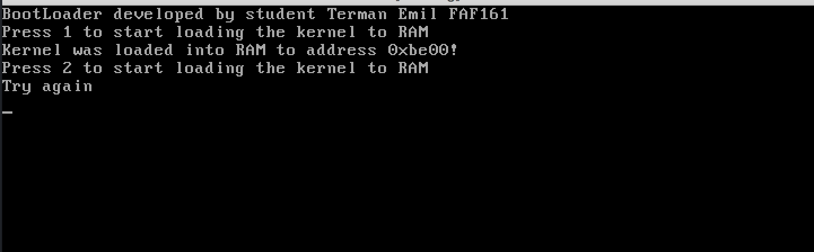
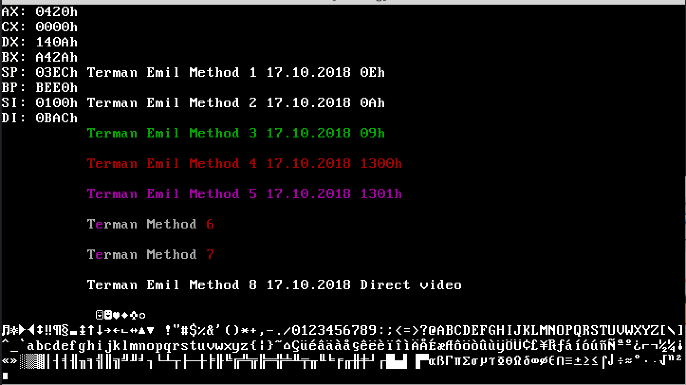

# Lab 2

## Loader

Size: 400*B*

The **loader**'s task is to load the kernel into RAM. This is necessary because we can't write it directly into the boot sector: Cylinder 0, Sector 1, Head 0, unless its size is not bigger than 512*B*.

#### Loader's tasks:
1. Read the kernel from the given Cylinder-Sector-Head
2. Run an integrity check. It's a simple check to see if it's more or less the right kernel. It simply checks if the first byte of the kernel is the expected one. In my case, the first byte of my kernel is `0x90` from `NOP` instruction;
3. Pass control to the kernel;

#### Conditions:

The Kernel code should be placed on the floppy image starting from sector Nr.N (where N = 3 * your_number_fromstudents_registry)

memory_address where the kernel will be loaded will be = 7c00h + 3 \* 256 \* your_number_fromstudents_registry)

My number from students registry is 22.
~~~
kernel_sector = 22 * 3 = 66
kernel_cylinder = (kernel_sector - 1) / 36 = (66 - 1) / 36 = 1

; if kernel_sector mod 18 == 0
;   return 18;
; else
;   return (kernel_sector mod 18);
; kernel_sector mod 18 = 12
actual_sector = 12

; From sector 1 -> 18   => head = 0
; From sector 19 -> 36  => head = 1
; From sector 37 -> 54  => head = 0
; From sector 55 -> 72  => head = 1
kernel_head = 1

; 0xbe00 = 7c00h + 3 * 256 * my_number_fromstudents_registry
kernel_memory_address = 0xbe00
~~~

* The Floppy Disk has 2 sides: Head 0 and Head 1.
* Each side has 80 Cylinders: from 0 -> 79.
* Each Cylinder has 18 sectors.
* Each sector can store 512 Bytes.

The control is passed to kernel by jumping to:
~~~
0800h:kernel_memory_address ; == 0800h:0xbe00
~~~

## Kernel

Size: 880*B*

The `org` (origin) is set to `kernel_memory_address` which is `0xbe00` in my case.

The first byte of the kernel must be `0x90` for integrity check, so `NOP` instruction is used. It is the first instruction.

Then I load in Data Segment (ds) the value `0800h`.

Because I encountered some glitches after the execution of the kernel, I place an infinite loop at the end, which asks user input.

## How to compile and run.
For this, I use emu8086.
1. Compile **loader** and **kernel** (into .bin)
2. Then press 'show emulator'
3. Press 'virtual drive'->'write .bin file to floppy'
4. Write the loader at Cylinder = 0, Sector = 1, Head = 0
5. Write the kernel at Cylinder = 1, Sector = 12, Head = 1
6. In the same place as emu8086.exe must be a file called **FLOPPY_0**. Copy it into 'kek.img'.
7. In Virtual Box, create a new OS:
  - Type: Other
  - Version: DOS
  - Default on the rest.
8. Choose 'kek.img'
9. Run
